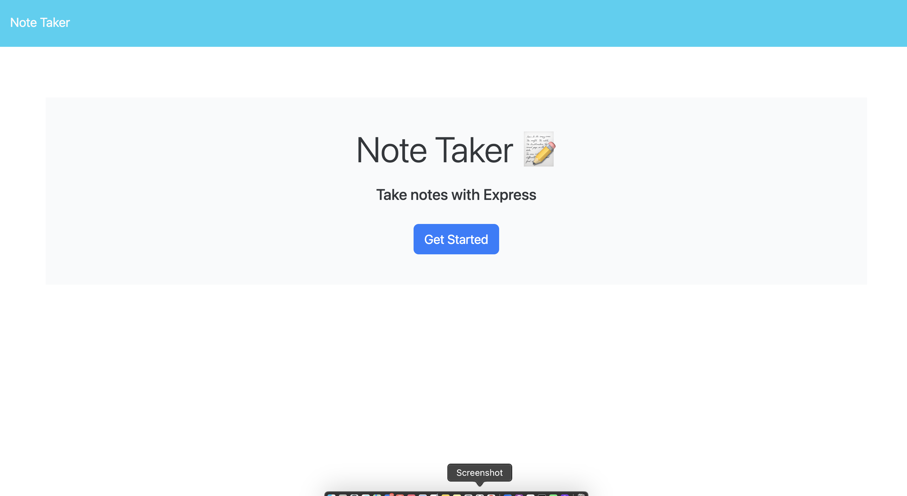
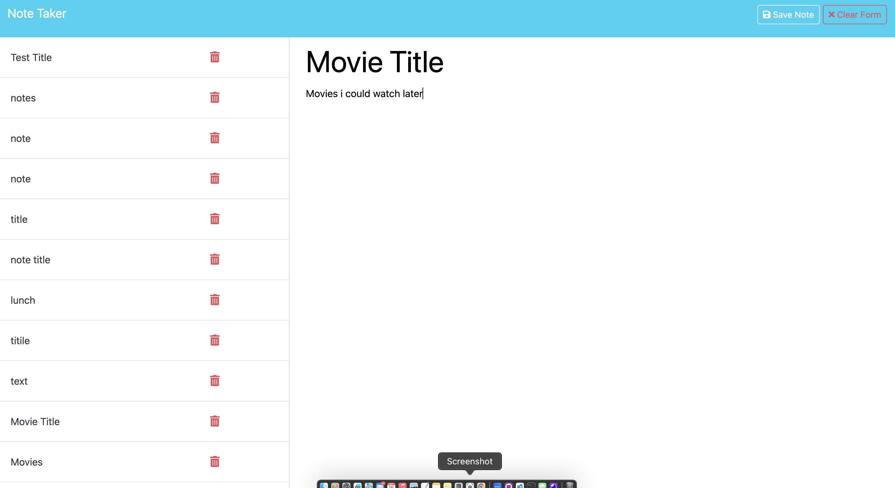
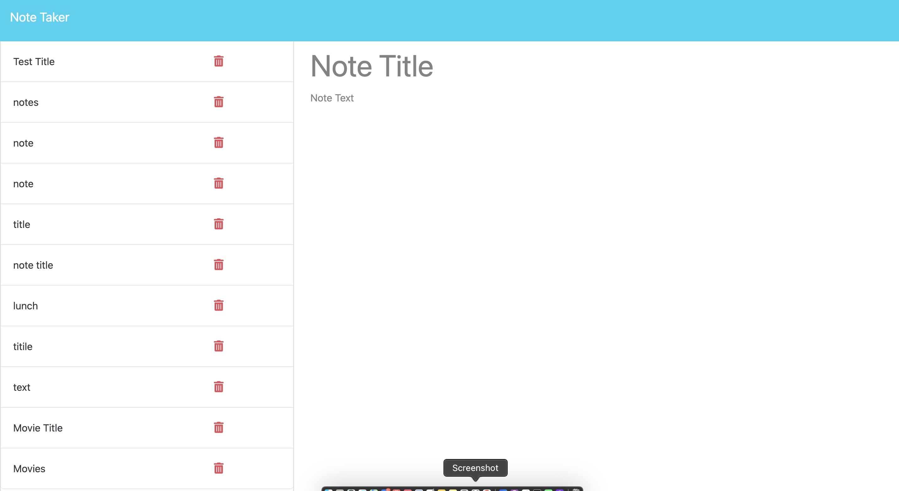
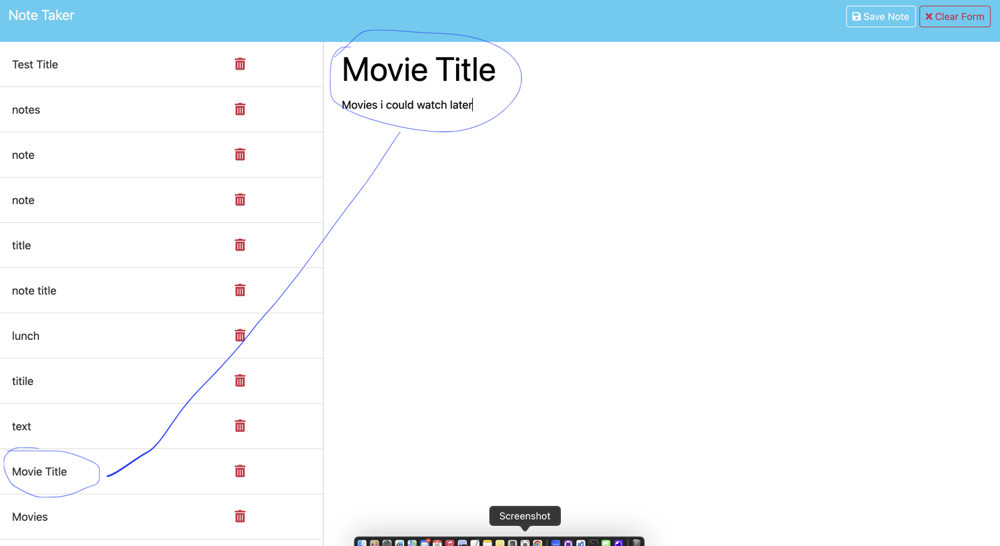
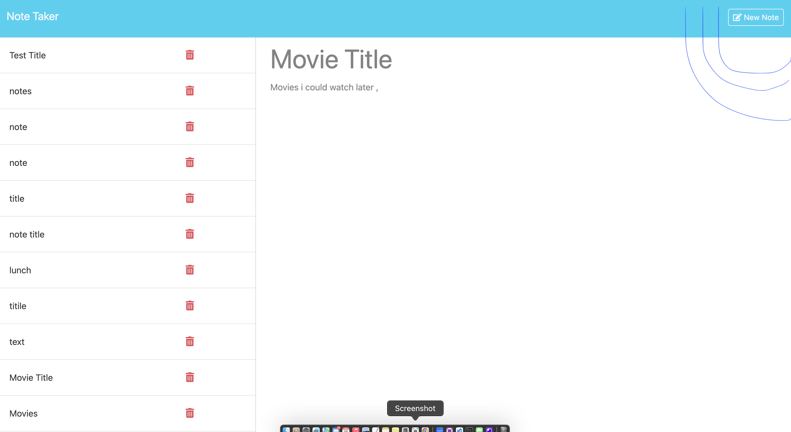

# Eleven-Note-Taker
An app that can be used to write and save notes 

## User Story 
AS A small business owner 
I WANT to be able to write and save notes
SO THAT I can organize my thought and keep track of tasks I need to complete 

## Usage 
When you open Note Taker 
You will be presented with a landing page with a link to a notes page 
 photo goes here<--  

When i click to the button "get started" int will take you to the notes page  
You will be present with a page with existing notes listed on the left handed column , plus empty fields to enter a new note title and the notes's text in the right-hand column 
 photo goes here<--  

When you enter a new note title and the note's text  
You will be presented with a "Save Note" button and a "Clear Form" button appear in the navigation at the top of the page 
 photo goes here<--  

When the Save button is clicked 
Then the new note that was entered is aved and appears in the left-hand column with the other existing notes and the buttons in the navigation disappears 
 photo goes here<--  

When clicked on an existing note in the list on the left-hand column 
Then a note appears in the right-hand column and a "note taker" button in the navigation at the top of the page  

When clicked on the " Note Taker" button int he navigation at the top of the page  
You will be presented with empty field to enter a new note title and the note's text in the right-hand column and the button disappears 
  
